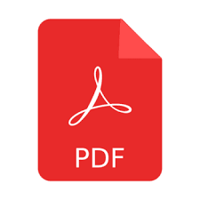
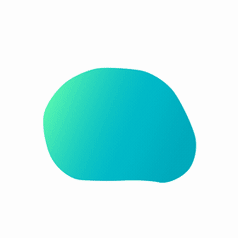

# CLAUDE.md — gawtamcr.github.io

Jekyll academic homepage for **Gawtam Chithra Ramesh** (MSc student, KTH Royal Institute of Technology; thesis at ABB Robotics).

---

## Key Files

| File | Purpose |
|------|---------|
| `_pages/about.md` | **All visible content** — every section of the homepage lives here |
| `_config.yml` | Site metadata, author sidebar links (name, bio, location, social links, CV URL, avatar) |
| `_includes/author-profile.html` | Sidebar HTML template — renders links from `_config.yml` author block |
| `_includes/head/custom.html` | Favicon links, MathJax config |
| `images/` | All images (profile, favicons, pdf icon, blob.gif, etc.) |

---

## `about.md` Structure

The file is one long HTML-in-Markdown document. Sections in order:

1. **About Me** — prose paragraph (plain Markdown)
2. **Research Interests** — two colored cards (`#eff6ff` blue, `#faf5ff` purple), each with bullet entries + links
3. **News** — vertical timeline (`.position:relative; padding-left:28px`) with colored dots per entry type
4. **Publications** — one `<table>` per paper; left cell = pdf.png image linking to arXiv; right cell = title, authors, venue, buttons
5. **Projects** — CSS grid (`grid-template-columns: repeat(2,1fr)`), each card = left 90px blob.gif + right content pane with title, keyword tags, links
6. **Work Experiences** — same vertical timeline style as News; dot color encodes role type
7. **Skills** — CSS grid of colored tag groups (Languages, Robotics, ML/DL, Tools, CAD)
8. **Honors and Awards** — flex column of left-bordered cards
9. **Services and Responsibilities** — plain text with year labels
10. **Educations** — plain text, two entries

---

## Section Patterns

### Timeline (News & Work Experiences)
```html
<div style="position:relative;padding-left:28px;margin:16px 0;">
<div style="position:absolute;left:8px;top:6px;bottom:6px;width:2px;background:#e5e7eb;border-radius:1px;"></div>

<div style="position:relative;margin-bottom:14px;">
  <div style="position:absolute;left:-22px;top:4px;width:10px;height:10px;border-radius:50%;background:COLOR;border:2px solid white;box-shadow:0 0 0 2px COLOR;"></div>
  <!-- News: date badge + text on two lines -->
  <!-- Work: date · Role · Org on one line, then badge + keywords on second line -->
</div>
```

**Dot colors:**
- `#6366f1` (indigo) — upcoming/in-progress
- `#3b82f6` (blue) — research/paper/position
- `#10b981` (green) — industry
- `#8b5cf6` (purple) — milestone/academic

### Publication Table
```html
<table style="MARGIN-BOTTOM:10px;FONT-SIZE:13px;BORDER-COLLAPSE:collapse;TEXT-ALIGN:left;WIDTH:98%;BACKGROUND-COLOR:#f6fbfe">
  <tr>
    <td style="WIDTH:110px;BACKGROUND-COLOR:#e2eff9;padding:8px;TEXT-ALIGN:center;">
      <a href="ARXIV_URL"></a>
    </td>
    <td style="padding:10px 14px;">
      <span style="font-weight:700;font-size:13px;">TITLE</span><br>
      <span style="font-size:12px;color:#374151;">AUTHORS</span><br>
      <em style="font-size:12px;">VENUE</em><br>
      <a href="..." style="background:#dbeafe;color:#1e40af;padding:2px 7px;border-radius:4px;font-size:11px;font-weight:600;text-decoration:none;margin:4px 3px 0 0;display:inline-block;">LABEL</a>
    </td>
  </tr>
</table>
```

### Project Card
```html
<div style="background:#f9fafb;border:1px solid #e5e7eb;border-radius:10px;overflow:hidden;display:flex;">
  <div style="background:#e2eff9;flex-shrink:0;width:90px;display:flex;align-items:center;justify-content:center;">
    
  </div>
  <div style="padding:12px 14px;">
    <div style="font-weight:700;font-size:13px;color:#111827;margin-bottom:8px;">TITLE</div>
    <div style="display:flex;flex-wrap:wrap;gap:4px;margin-bottom:8px;">
      <span style="background:#f3f4f6;color:#374151;padding:2px 7px;border-radius:4px;font-size:11px;font-weight:600;">TAG</span>
    </div>
    <a href="..." style="background:#dbeafe;color:#1e40af;padding:2px 7px;border-radius:4px;font-size:11px;font-weight:600;text-decoration:none;">LABEL</a>
  </div>
</div>
```

### Work Experience Entry
```html
<div style="position:relative;margin-bottom:14px;">
  <div style="position:absolute;left:-22px;top:4px;width:10px;height:10px;border-radius:50%;background:COLOR;border:2px solid white;box-shadow:0 0 0 2px COLOR;"></div>
  <div style="font-size:13px;color:#374151;font-weight:600;">
    <span style="font-size:11px;color:#9ca3af;font-weight:500;">MM/YYYY – MM/YYYY</span> · ROLE · <span style="font-weight:400;">ORG, CITY</span>
  </div>
  <div style="display:flex;flex-wrap:wrap;gap:4px;margin-top:5px;">
    <span style="background:BADGE_BG;color:BADGE_FG;padding:1px 6px;border-radius:3px;font-size:10px;font-weight:600;">🔬 TYPE</span>
    <span style="background:#f3f4f6;color:#374151;padding:1px 7px;border-radius:4px;font-size:11px;font-weight:600;">KEYWORD</span>
  </div>
</div>
```

**Badge colors by type:**
- Research: `background:#dbeafe; color:#1e40af`
- Industry: `background:#d1fae5; color:#065f46`
- Academic: `background:#ede9fe; color:#4c1d95`

---

## `_config.yml` Author Block (sidebar)

Key fields — edit here to update sidebar:
```yaml
author:
  name: "Gawtam Chithra Ramesh"
  avatar: "images/profile.png"
  bio: "Robotics Graduate Student at KTH"
  location: "Stockholm, Sweden"
  googlescholar: "https://scholar.google.com/citations?user=Qy-ByYcAAAAJ&hl=en"
  cv: "https://gawtamcr.github.io/images/Gawtam_CV.pdf"
  email: "gawtamcr3@gmail.com"
  linkedin: "gawtamcr"
  github: "gawtamcr"
```

---

## Images

| File | Used for |
|------|----------|
| `images/profile.png` | Sidebar avatar |
| `images/pdf.png` | Publication thumbnail (links to arXiv) |
| `images/blob.gif` | Project card left-side image (all 6 cards) |
| `images/favicon-32.png` | Browser favicon 32×32 |
| `images/favicon-16.png` | Browser favicon 16×16 |
| `images/favicon-apple-touch.png` | iOS home screen icon |
| `images/kth-logo-blue.png` | KTH logo (available for use) |

---

## Placeholders to Fill In

- `https://arxiv.org/abs/XXXX.XXXXX` — arXiv IDs for IMPROVE 2026 and ICPR 2026 papers
- `[GAWTAM_TO_FILL: GitHub repo URL]` — ROMADO code repo URL (line ~136 in about.md)

---

## Deploy

All changes are file edits only — push to `main` branch on GitHub, Pages builds automatically.
Remote is SSH: `git@github.com:gawtamcr/gawtamcr.github.io.git`
